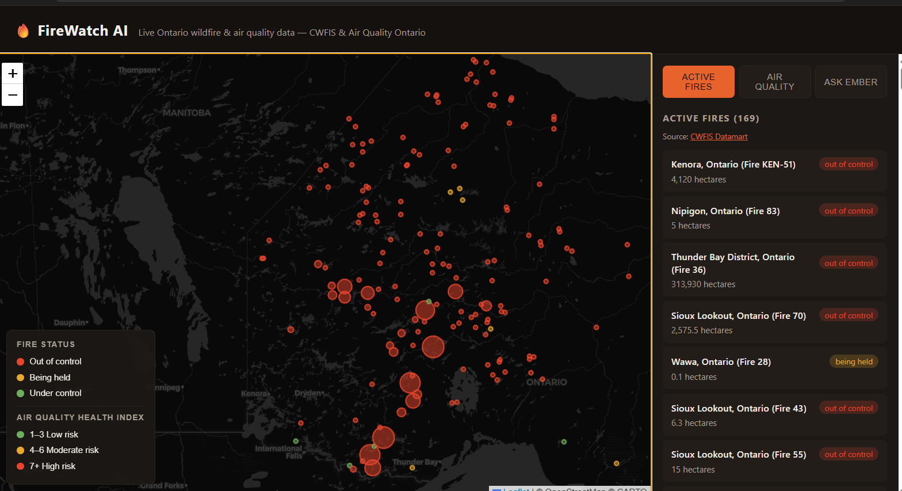
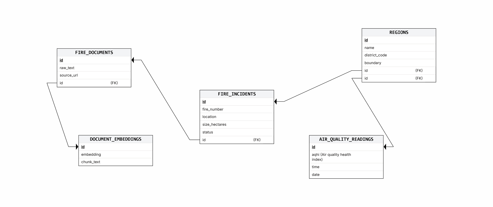

# FireWatch AI



Real Ontario wildfire and air quality data, unified in one dashboard, with an AI assistant that answers questions using that real data.

## Why

In early July 2026, Ontario's had a serious wildfire season this year. Fire status and air quality data both exist but on separate government sites with no easy way to browse them together. This pulls both into one database and puts a simple interface on top.

## 🚀 Key Features

**Active Fires**
- Real, currently active Ontario wildfires on a live map, color-coded by status
- List view with region, size, and status for each fire

**Air Quality**
- Real, current AQHI readings for Ontario cities
- Same map/list pattern as fires, so it's easy to browse

**Ask Ember**
- AI assistant that answers questions about the fires and air quality above
- Uses RAG, so every answer is grounded in real data, not a guess
- Only knows about fires and air quality — nothing else

## Architecture

```
Browser (map + tabs: Fires / Air Quality / Ask Ember)
        │ fetch() → JSON
        ▼
FastAPI backend  ──────────────►  PostgreSQL + PostGIS + pgvector
        │                                │
        │ question + retrieved context   │  fires, air quality,
        ▼                                │  generated text, embeddings
   Ollama (local)  ◄──────────────────────┘
   - nomic-embed-text (embeddings)
   - llama3.1:8b (chat)
```

The frontend only talks to the backend over HTTP. The backend is the only thing that talks to Postgres or Ollama. Two pipeline scripts feed real data into Postgres; the RAG agent turns that data into text, embeds it, and Ember queries it at request time.

## ETL Pipelines

Two scripts pull real data into the database:

- **`load_fires.py`** — downloads the CWFIS active fires CSV, filters to Ontario, matches each fire to its region, and inserts it
- **`load_air_quality.py`** — scrapes the Air Quality Ontario station table, matches each station to a region, and inserts the readings

Both follow extract → transform → load: get the raw data, clean and match it against `regions`, then write it in.

## How Ember works

Fire and air quality rows get turned into plain sentences (e.g. "Fire RED_FIRE_009 near Red Lake, Ontario is currently out of control, burning 177.2 hectares"). Each sentence is embedded with Ollama's `nomic-embed-text` and stored in Postgres via pgvector. When someone asks a question, it gets embedded the same way, pgvector finds the closest matching sentences, and `llama3.1:8b` answers using only those as context.

## 🛠️ Tech Stack

- **Backend:** FastAPI
- **Database:** PostgreSQL + PostGIS + pgvector (Docker)
- **AI:** Ollama (`llama3.1:8b`, `nomic-embed-text`)
- **Frontend:** Plain HTML/CSS/JS + Leaflet
- **Data:** pandas (CSV + HTML scraping)

## 📂 Project Structure

```
FireWatch.AI/
├── Dockerfile
├── backend/
│   ├── server/main.py           # FastAPI app
│   ├── pipelines/                # ETL scripts
│   │   ├── load_fires.py
│   │   └── load_air_quality.py
│   └── rag_agent/                # Ember's knowledge base
│       ├── generate_data.py
│       └── embeddings.py
└── frontend/
    └── website.html
```

## Database 
(NOTE: USED [ERDPlus] to build the Entity relationship and Relational Schema initally (https://erdplus.com/)![Conceptual entity relationship diagram])


**Conceptual ER diagram** — entities, their attributes and how they relate:
[Conceptual Entity relationship diagram](./images/erd.png)

Five entities: `regions`, `fire_incidents`, `air_quality_readings`, `fire_documents`, `document_embeddings`. Each oval is an attribute, each diamond is a relationship, and the `(1,M)` labels on the connecting lines show cardinality — read as "one side, many side." Concretely:

- **`regions` (1) — contains — (M) `fire_incidents`**: one region can contain many fires, but each fire belongs to exactly one region
- **`regions` (1) — contains — (M) `air_quality_readings`**: one region can have many readings over time, each reading belongs to one region
- **`fire_incidents` (1) — describes — (M) `fire_documents`**: one fire can have multiple generated sentences describing it
- **`fire_documents` (1) — chunked into — (M) `document_embeddings`**: one document can produce multiple embedded chunks (in this project, one sentence per document, so it's 1:1 in practice, but modeled as 1:M since that's the general case)

**Relational schema** — the same design, normalized into tables with primary and foreign keys:



Every table has its own `id` as primary key. Foreign keys are what actually implement the relationships above: `fire_incidents.region_id`, `air_quality_readings.region_id`, `fire_documents.fire_id`, and `document_embeddings.document_id` each point back to the parent table's primary key. Postgres enforces these — a fire can't reference a region that doesn't exist, an embedding can't reference a document that doesn't exist.

**Why it's structured this way:** fires and air quality readings both depend on `regions` existing first, since neither makes sense without a real location attached. `fire_documents` and `document_embeddings` exist specifically to support Ember — they're generated *from* the fire and air quality data, not sourced externally, and they form their own small chain (fire → generated sentence → embedded vector) so the RAG search has something to query against.

5 tables, all real and populated: `regions` (51), `fire_incidents` (168), `air_quality_readings` (38), `fire_documents` (207 generated sentences), `document_embeddings` (207 vectors).

## Data Sources

- Fires: [CWFIS Datamart](https://cwfis.cfs.nrcan.gc.ca/datamart) (Got CSV From under Theme "Fire mapping and monitoring" which provides Active Wildfires in Canada data)
- Air quality: [Air Quality Ontario](https://www.airqualityontario.com/aqhi/index.php)

Both free, no key required.

## 🚀 Getting Started

**Prerequisites:** Docker, Python 3.11+, [Ollama](https://ollama.com)

```bash
git clone https://github.com/famitt123/FireWatch.AI

# Database
docker build -t firewatch-postgres-image .
docker run --name firewatch-postgres -e POSTGRES_USER=firewatch -e POSTGRES_PASSWORD=devpassword -e POSTGRES_DB=firewatch -p 5432:5432 -v firewatch-pgdata:/var/lib/postgresql/data -d firewatch-postgres-image

# Backend
cd backend
python -m venv venv
venv\Scripts\activate
pip install -r requirements.txt

# AI models
ollama pull llama3.1:8b
ollama pull nomic-embed-text

# Load real data
cd pipelines
python load_fires.py
python load_air_quality.py

# Generate Ember's knowledge
cd ../rag_agent
python generate_data.py
python embeddings.py

# Run backend
cd ../server
uvicorn main:app --reload

# Run frontend (separate terminal)
cd ../../frontend
python -m http.server 5500
```

Visit `http://127.0.0.1:5500/website.html`.

Runs locally only — Ollama needs a local server, and free hosting can't run that.

## Known Limitations

- Air quality coverage is partial (fire districts and AQ stations use different boundaries)
- No login or personalized alerts 
- `pm25` column exists but is unused (source only gives AQHI)
- Using a local LLM (Ollama) means it can only run on one machine and can't be deployed as a website.

## Future Plans

- Auth + saved locations for personalized alerts
- Scheduled pipeline instead of manual runs
- Real narrative bulletins as a richer source for Ember
- Public deployment once there's a hosting plan for the AI layer

## LIVE DEMO COMING SOON................